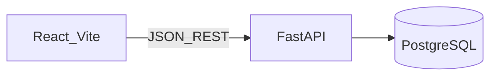

# Customer Information API

Enterprise-style full-stack app: **FastAPI** + **PostgreSQL** + **React (Vite, TypeScript, shadcn-style UI)**.

## Features

- **REST API**: `POST /api/customers`, `GET /api/customers`, `GET /api/customers/{id}` (pagination on list)
- **Layered backend**: routers (HTTP) → services (use-cases) → repositories (SQLAlchemy)
- **Validation**: Pydantic on the API, Zod + React Hook Form on the UI (aligned rules)
- **Persistence**: PostgreSQL, **Alembic** migrations, async SQLAlchemy
- **Ops**: `docker compose up --build` runs DB, API (migrations on startup), and Vite dev server

## Architecture (high level)



## Setup (Docker)

Prerequisites: **Docker** and **Docker Compose**.

```bash
docker compose up --build
```

| Service   | URL                          |
| --------- | ---------------------------- |
| API       | http://localhost:8000      |
| OpenAPI   | http://localhost:8000/docs |
| Frontend  | http://localhost:5173      |

Without Docker, use `backend/.env` and `frontend/.env` with the same variables as in `docker-compose.yml`.

The browser calls the API at **`http://localhost:8000`** (`VITE_API_BASE_URL` in Compose) so CORS matches the host.

## Development (without Docker)

### Backend

```bash
cd backend
python -m venv .venv
# Windows: .venv\Scripts\activate
pip install -e ".[dev]"
# DATABASE_URL + CORS_ORIGINS in backend/.env; Postgres running
alembic upgrade head
uvicorn app.main:app --reload --port 8000
```

### Frontend

```bash
cd frontend
npm install
# VITE_API_BASE_URL in frontend/.env
npm run dev
```

### Tests

```bash
cd backend; pytest -q
cd frontend; npm run test
```

Backend tests use **SQLite in-memory** + FastAPI dependency overrides (no Docker required for `pytest`).

## License

Private / assessment use.
