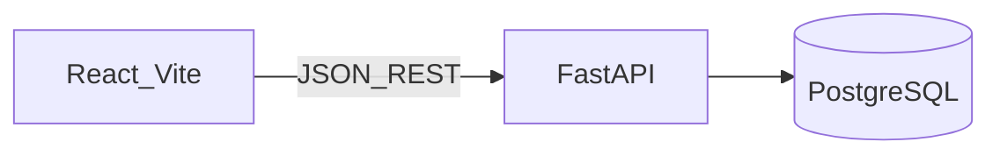

# Customer Information API

Enterprise-style full-stack app: **FastAPI** + **PostgreSQL** + **React (Vite, TypeScript, shadcn-style UI)**.

## Features

- **REST API**: `POST /api/customers`, `GET /api/customers`, `GET /api/customers/{id}` (pagination on list)
- **Layered backend**: routers (HTTP) → services (use-cases) → repositories (SQLAlchemy)
- **Validation**: Pydantic on the API, Zod + React Hook Form on the UI (aligned rules)
- **Persistence**: PostgreSQL, **Alembic** migrations, async SQLAlchemy
- **Ops**: `docker compose up --build` runs DB, API (migrations on startup), and Vite dev server

## Architecture (high level)



## Setup (Docker)

Prerequisites: **Docker** and **Docker Compose**.

```bash
docker compose up --build
```

| Service   | URL                          |
| --------- | ---------------------------- |
| API       | http://localhost:8000      |
| OpenAPI   | http://localhost:8000/docs |
| Frontend  | http://localhost:5173      |

Environment templates: [backend/.env.example](backend/.env.example), [frontend/.env.example](frontend/.env.example).

The browser calls the API at **`http://localhost:8000`** (see `VITE_API_BASE_URL` in Compose) so CORS matches your host machine.

## Development (without Docker)

### Backend

```bash
cd backend
python -m venv .venv
# Windows: .venv\Scripts\activate
pip install -e ".[dev]"
# Set DATABASE_URL (see backend/.env.example), ensure Postgres is running
alembic upgrade head
uvicorn app.main:app --reload --port 8000
```

### Frontend

```bash
cd frontend
npm install
# Set VITE_API_BASE_URL=http://localhost:8000 (see frontend/.env.example)
npm run dev
```

### Tests

```bash
cd backend; pytest -q
cd frontend; npm run test
```

Backend tests use **SQLite in-memory** + FastAPI dependency overrides (no Docker required for `pytest`).

## Interview notes (quick)

- **Why layers?** Routers stay thin; business rules and enrichment live in `CustomerService`; SQL stays in `CustomerRepository` — easier unit testing and swapping storage later.
- **Why SWR?** Automatic deduplication and cache-friendly refetch after `POST` (`mutate()`).
- **Why sanitize on the API?** Defense in depth: ORM prevents SQL injection; `html.escape` on free-text reduces stored XSS if the same data is rendered in HTML elsewhere.

## License

Private / assessment use.
